# Layout catalog

Purpose: one section per diagram family. Each section says when the family
fits, which direction to use, gives a Mermaid sample that renders, and lists the
mistakes that usually happen with it. Read the section for the family chosen in
Step 1 of `SKILL.md`. Read two sections when the choice is between two families.

All samples were rendered with Mermaid 11. Node labels are English placeholders.
Replace them with the user's content in the user's language.

Contents

1. Linear process (LR and TD)
2. Flowchart with decisions
3. Decision tree
4. Cycle (ring layout)
5. Hierarchy, org chart, tree
6. Mind map (radial)
7. Network, relationship map
8. Data flow, architecture (pipeline and layered stack)
9. Timeline
10. Sequence diagram
11. State diagram
12. 2x2 matrix, quadrant
13. Funnel
14. Swimlanes
15. Side-by-side comparison (before and after)
16. Stack of layers
17. Convergence and fan-out
18. Sankey
19. Overview plus detail (splitting a big diagram)

---

## 1. Linear process

Fits: steps in a fixed order, one path, no branches.

Direction: LR when there are 6 or fewer steps and each label is 1 to 3 words.
TD otherwise. Long labels stacked vertically stay inside a phone screen. Short
labels in a row read like a sentence.

Short labels, few steps, LR:

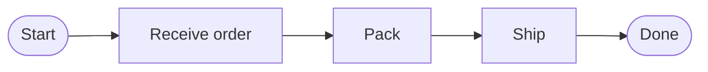

Long labels or many steps, TD:

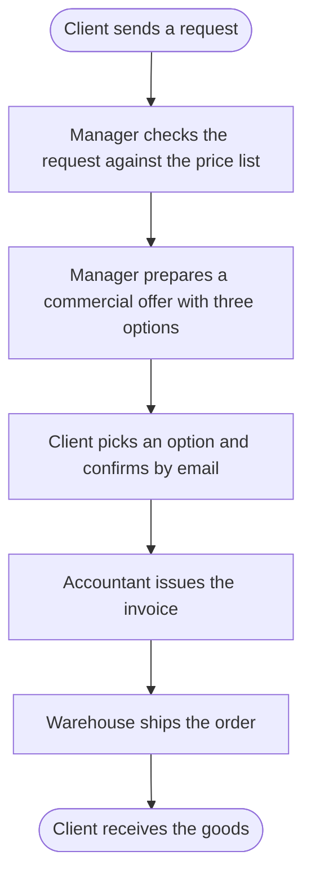

Mistakes: drawing a process as a mind map (order is lost). Ten steps in one
horizontal row (runs off the screen). Arrowheads missing (a process without
arrows reads as a list of unrelated boxes).

---

## 2. Flowchart with decisions

Fits: a process with checks, branches, retries, or error paths.

Direction: TD. The main path runs straight down. `Yes` continues down, `No`
branches to the side and either rejoins or loops back. Every diamond has two or
more labeled exits.

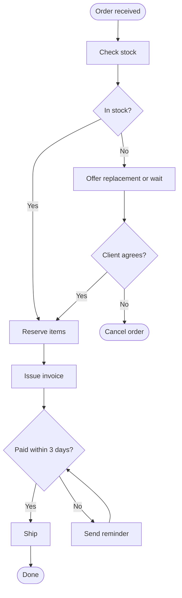

Mistakes: a diamond with one exit. Exits without labels. A loop back drawn as a
long unlabeled arrow to the very top instead of to the step that repeats.
Terminals (start, end, cancel) drawn as ordinary rectangles.

---

## 3. Decision tree

Fits: rules of the form "if X then Y, else Z", classification, support scripts,
"which plan do I need".

Direction: TD. Questions are diamonds, answers on the arrows, outcomes at the
leaves as stadiums or rectangles. Use LR only when the tree is 4 or more levels
deep and labels are short, so the levels become columns.

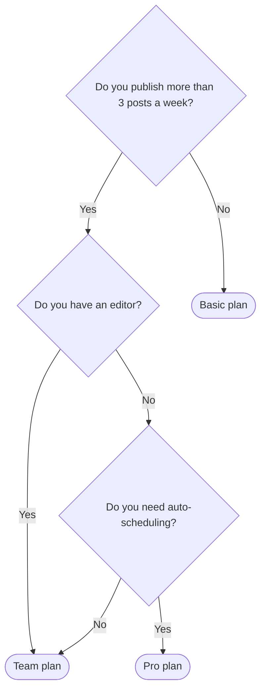

Mistakes: mixing questions and actions at the same level. Two leaves that mean
the same outcome under different names (merge them into one node with two
incoming arrows, as `R2` above). A tree drawn as a mind map (the branches must
be labeled with the answer, mind maps cannot label branches).

---

## 4. Cycle (ring layout)

Fits: steps that repeat: plan, do, check, act. Content lifecycles. Feedback loops.

Direction: a ring, clockwise, starting at the top-left. Mermaid flowcharts
have no circle layout and subgraph tricks do not work (see the cheatsheet,
section 4). Use `block-beta`, which places blocks on a fixed grid: a 3-column
grid with the corners filled and the middle left empty gives a square ring.

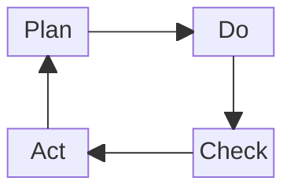

For 6 steps use `columns 3` with three rows: top row `A space B`, middle row
`F space C`, bottom row `E space D`, arrows A-B-C-D-E-F-A. For 8 steps use
`columns 4` with all edge cells filled and the four center cells `space`.

`block-beta` needs a recent Mermaid (verified on 11). When the renderer is unknown, use a
state diagram. The exit is explicit and the loop is readable:

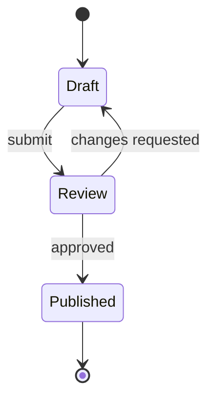

For 5 to 8 steps with an exit condition, a TD flowchart with the loop-back
arrow labeled with the condition also works:

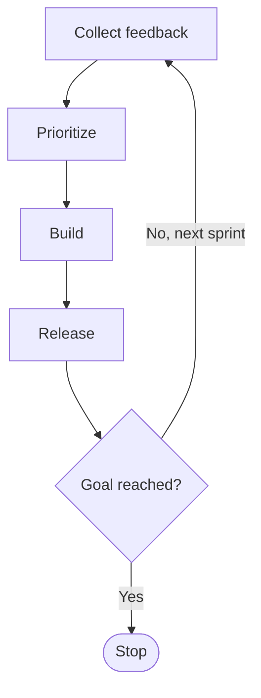

Mistakes: a cycle drawn as a straight LR line with one long return arrow (the
reader sees a line, not a loop). Subgraphs with `direction LR` and `RL` to
fake a ring: Mermaid ignores subgraph direction when nodes link across
subgraphs, and the result is a column. No exit condition when the process
actually ends. Four steps in a mind map (the order disappears).

---

## 5. Hierarchy, org chart, tree

Fits: whole and its parts, who reports to whom, folder structures, taxonomies,
product lines.

Direction: TD with the root on top. Lines without arrowheads (`---`), because
there is no flow, only membership. LR when the tree is wide and shallow (one
root, 8+ leaves, one level), so the leaves stack in a column.

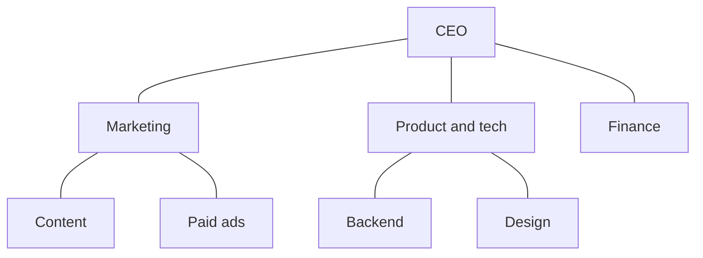

Wide and shallow, LR:

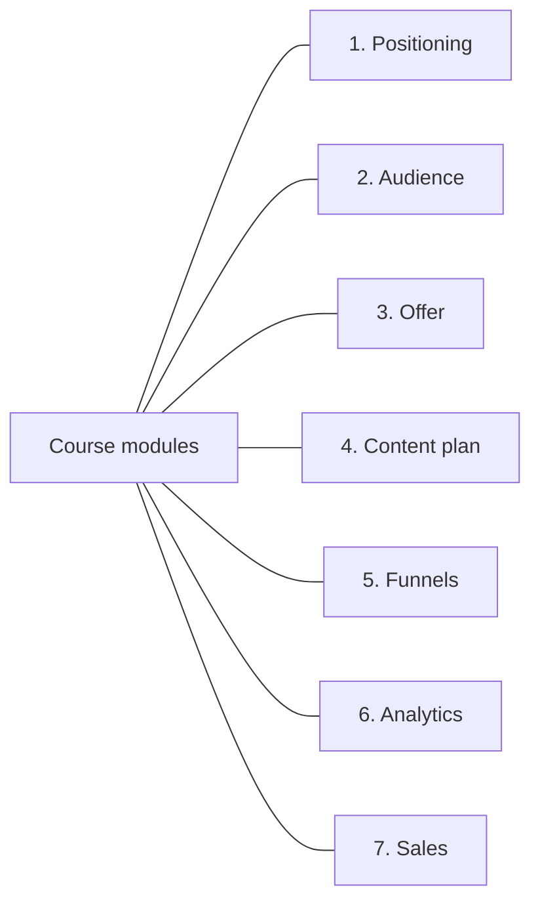

Mistakes: arrowheads on hierarchy lines (reads as delegation or flow). Peers at
different visual levels. Roles and people mixed in one node.

---

## 6. Mind map (radial)

Fits: a topic and its associations when there is no order and no cause between
the branches. Brainstorm dumps, content pillars, feature areas.

Direction: radial. The center is the topic, branches spread around it. Mermaid
`mindmap` does this automatically. Indentation defines the levels. Do not use a
mind map when the branches are steps in order, rules with conditions, or
components exchanging data. Those are other families.

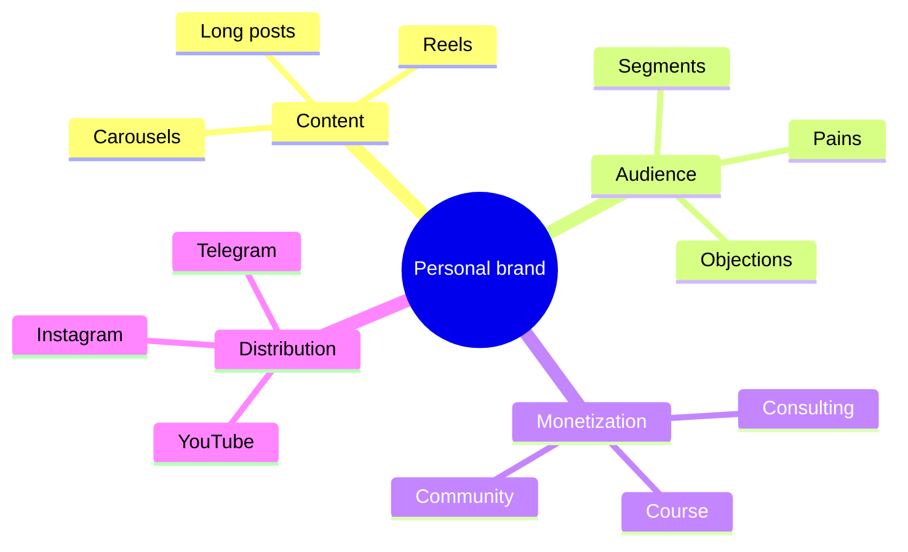

Rules: 3 to 7 first-level branches. Each branch 2 to 6 children. Deeper than
three levels: cut the sub-branch into its own mind map. Keep sibling labels the
same grammatical form (all nouns or all verb phrases).

Mistakes: a mind map for a process. Branch labels that are full sentences. One
branch with 12 children next to a branch with 1.

---

## 7. Network, relationship map

Fits: many-to-many links: who talks to whom, which services depend on which,
which channels feed which.

Direction: none. Use lines without arrowheads for symmetric relations and
labeled arrows only where the relation has a direction (`depends on`,
`sends leads to`). Let the layout engine place the nodes. Keep it to 12 nodes.

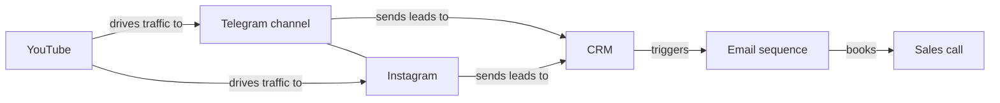

Mistakes: a network forced into TD or LR ranks so that a symmetric relation
looks like a hierarchy. Unlabeled arrows, so the reader cannot tell dependency
from data flow.

---

## 8. Data flow, architecture

Fits: components and the data or requests moving between them.

Direction: LR for a pipeline (source on the left, sink on the right). TD for a
layered system (user or UI on top, storage at the bottom). Storage is a
cylinder. Every arrow carries the name of what moves or how often.

Pipeline, LR:

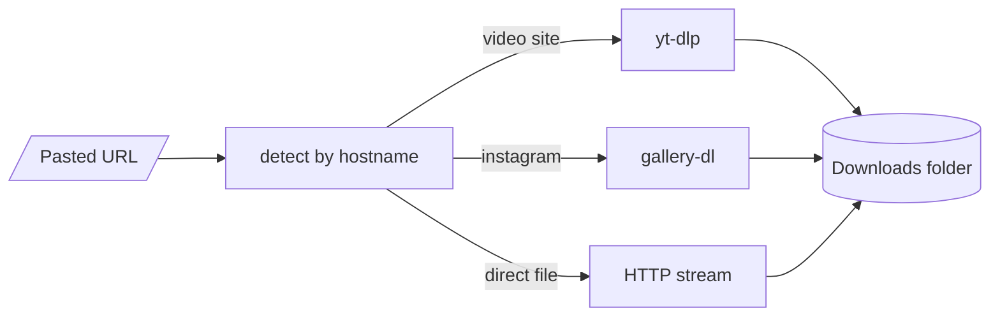

Layered stack, TD:

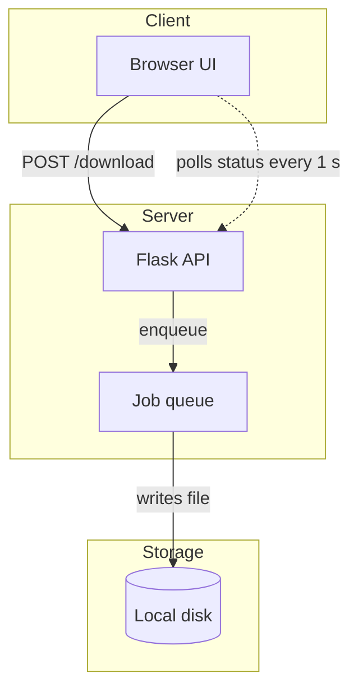

Mistakes: a component named but the path through it not drawn. Unlabeled
arrows. Both directions of a request drawn as two arrows where one labeled
arrow with `request / response` would do.

---

## 9. Timeline

Fits: events placed in time: launch plan, history, roadmap, a week of a
campaign.

Direction: LR, oldest on the left. TD when each entry needs a sentence of
description, because the entries become rows.

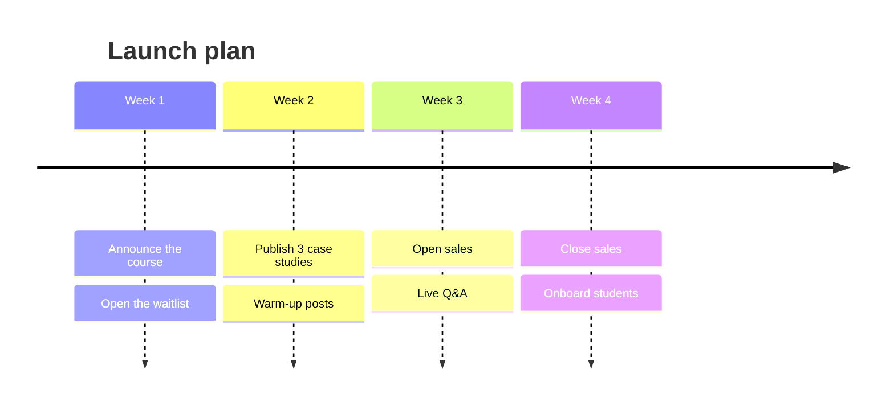

Vertical alternative for long descriptions:

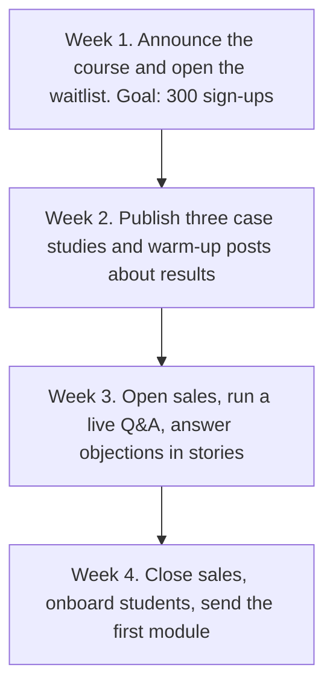

Mistakes: events out of chronological order. Mixing a timeline (when) with a
process (how). A radial mind map for dates.

---

## 10. Sequence diagram

Fits: two or more actors exchanging messages in a fixed order: client and
server, customer and support, user and bot.

Direction: fixed by the diagram type. Actors across the top, time runs down.
Solid arrows are requests, dashed arrows are responses.

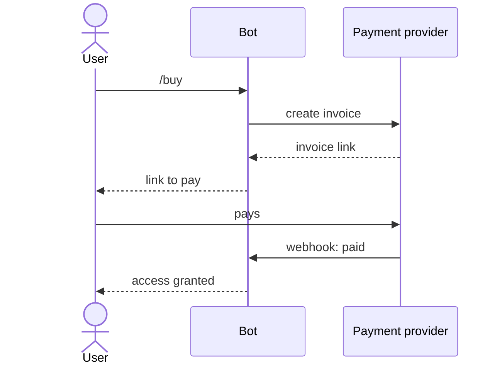

Mistakes: using a flowchart for a message exchange (the actors get lost).
Responses drawn as solid arrows. More than 5 actors in one diagram.

---

## 11. State diagram

Fits: one object that switches between modes: order status, subscription
status, lead stage.

Direction: LR for up to 5 states, TD for more. Every transition is labeled with
the event that causes it. `[*]` marks the start and the end.

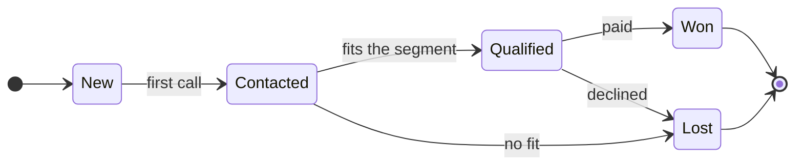

Mistakes: unlabeled transitions. States named as actions (`Calling`) instead of
conditions (`Contacted`). A state with no way out and no end marker.

---

## 12. 2x2 matrix, quadrant

Fits: items compared on two independent criteria: effort and impact, urgency
and importance, price and quality.

Direction: grid. Name both axes with both ends. Name all four quadrants.

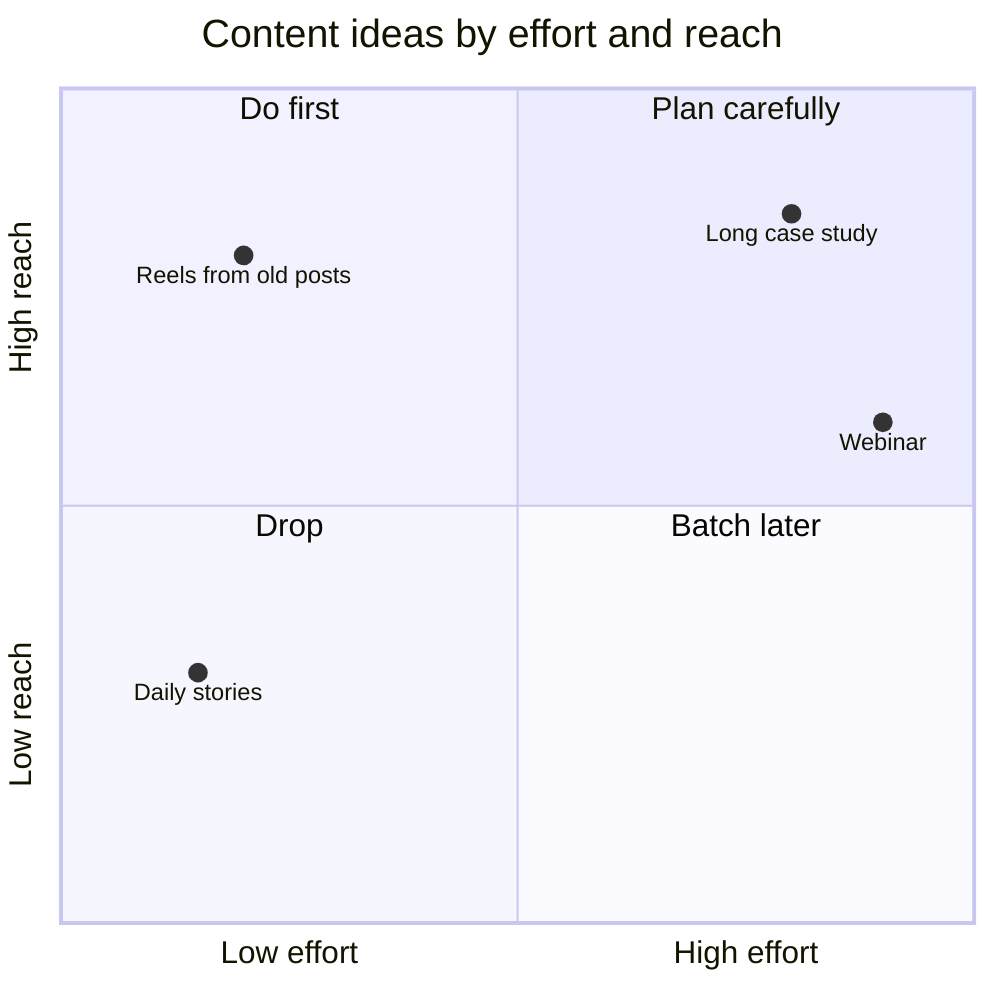

Plain-text alternative when the renderer has no `quadrantChart`: a markdown
table with two columns and two rows, axis names in the header and first column.

Mistakes: criteria that are not independent (the items line up on a diagonal).
Axes without direction words. A quadrant drawn as a flowchart.

---

## 13. Funnel

Fits: stages where the number of people shrinks: visitors, subscribers, leads,
buyers.

Direction: TD, widest stage on top. Mermaid has no funnel shape. Put the count
and the conversion in the labels and let the shrinking numbers carry the shape.
Show the drop between stages on the arrows.

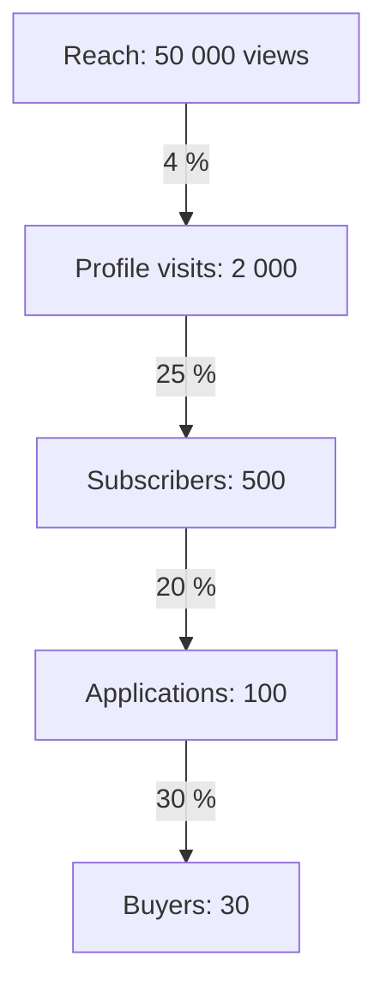

Where widths matter (a slide), draw the funnel as an SVG or in the design tool
with trapezoids whose widths follow the counts.

Mistakes: a funnel with no numbers. Stages that are not subsets of the previous
stage. Drawing it LR (a horizontal funnel reads as a pipeline).

---

## 14. Swimlanes

Fits: several roles or departments each doing their own steps in one process:
client, manager, accountant.

Direction: one lane per role, steps in time order, handoffs cross lanes.

Mermaid cannot draw true swimlanes. Subgraphs as lanes fail: when nodes link
across subgraphs, Mermaid ignores the subgraph `direction`, and the lanes end
up as scattered clusters. Use one of these instead.

Option A, sequence diagram. Roles are the actors across the top, time runs
down, each handoff is a message. Best when the point is who hands what to whom.

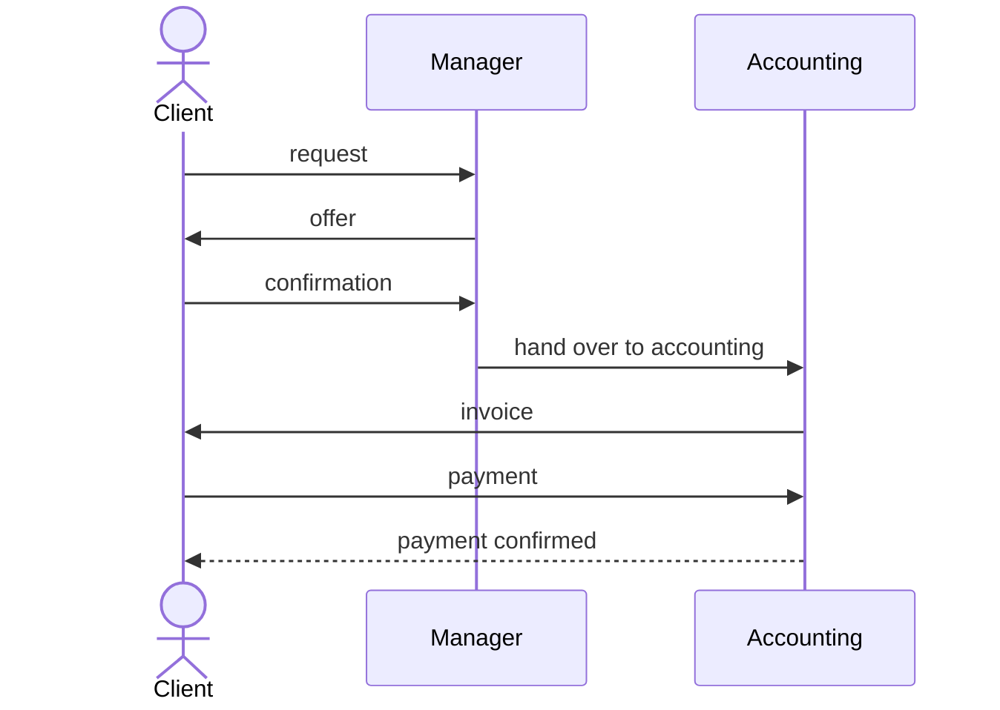

Option B, one TD flowchart with the role in each label and one color per role.
Best when the steps matter more than the messages, and when there are branches.

```mermaid
flowchart TD
  C1[Client: sends request]:::client --> M1[Manager: prepares offer]:::manager
  M1 --> C2[Client: confirms offer]:::client
  C2 --> M2[Manager: passes to accounting]:::manager
  M2 --> A1[Accounting: issues invoice]:::acct
  A1 --> C3[Client: pays invoice]:::client
  C3 --> A2[Accounting: confirms payment]:::acct
  classDef client fill:#e3f2fd,stroke:#1565c0,color:#000
  classDef manager fill:#fff3e0,stroke:#ef6c00,color:#000
  classDef acct fill:#e8f5e9,stroke:#2e7d32,color:#000
```

Option C, real lanes. Draw them in FigJam (Figma MCP `generate_diagram`),
Miro, or hand-written SVG: one horizontal band per role with the role name on
the left, steps placed left to right by time, vertical arrows for handoffs.

Mistakes: subgraphs as lanes in Mermaid. Steps of one role scattered across
lanes. Lanes without a role name. More than 5 roles (split the process).

---

## 15. Side-by-side comparison (before and after)

Fits: two options, or the state before and after a change.

Direction: two diagrams with the same family, the same direction and the same
node names, placed next to each other. The only thing that changes is the
difference being sold. Highlight the changed node or edge with one color. A
reader must be able to point at what is different.

```mermaid
flowchart TD
  subgraph before[Before]
    direction LR
    A1[Client writes in DM] --> A2[Manager answers by hand] --> A3[Manager sends invoice] --> A4[Manager checks payment]
  end
  subgraph after[After]
    direction LR
    B1[Client writes in DM] --> B2[Bot answers and sends invoice] --> B3[Payment confirmed automatically]
  end
  before ~~~ after
  classDef changed fill:#ffe8a3,stroke:#b8860b,color:#000
  class B2,B3 changed
```

The outer direction is TD so the two halves stack. Each half sets
`direction LR`. The invisible edge `before ~~~ after` connects the subgraphs
themselves, not nodes inside them, so the inner direction is kept and `Before`
stays on top. Without that edge Mermaid may put `After` first.

Alternative: one diagram where the removed hop is drawn dashed and labeled
`removed`, and the added hop is drawn in color and labeled `added`.

Mistakes: two boxes named `Option A` and `Option B` with nothing inside (a
restated list, not a comparison). Different directions or different node names
in the two halves, so the reader compares layouts instead of content.

---

## 16. Stack of layers

Fits: layers built on top of each other: infrastructure, product, brand.
A pyramid of needs. A tech stack.

Direction: TD, foundation at the bottom. Use BT when the story is "we build up
from the base". Layers are subgraphs or wide nodes, no arrows between them
unless one layer calls another.

```mermaid
flowchart BT
  L1[Foundation: positioning and audience]
  L2[Product: offer, price, format]
  L3[Content: posts, reels, cases]
  L4[Traffic: ads, collaborations]
  L1 --> L2 --> L3 --> L4
```

Mistakes: a stack drawn LR (layers become a pipeline). The foundation on top.

---

## 17. Convergence and fan-out

Convergence fits: many inputs combine into one result. Direction: LR or BT,
many nodes into one.

```mermaid
flowchart LR
  A[Audience analysis] --> R[Offer]
  B[Competitor review] --> R
  C[Own cases] --> R
  D[Price test] --> R
```

Fan-out fits: one source feeds many targets. Direction: TD, so the targets line
up in a row under the source. Radial (`mindmap`) when the targets have no order.

```mermaid
flowchart TD
  S[One long post] --> R1[3 reels]
  S --> R2[Carousel]
  S --> R3[Email]
  S --> R4[5 stories]
```

Mistakes: fan-out drawn LR with 6 targets (a tall column of arrows fanning to
the right, hard to scan).

---

## 18. Sankey

Fits: quantities that split and merge: traffic by source to outcomes, budget
distribution, where leads go.

Direction: LR. Values must be real numbers, the widths are proportional.

```mermaid
sankey-beta
Instagram,Subscribed,300
Instagram,Left,1700
Telegram,Subscribed,450
Telegram,Left,550
Subscribed,Bought,90
Subscribed,Did not buy,660
```

`sankey-beta` needs a recent Mermaid. When the renderer is unknown, use a
table or a funnel instead.

---

## 19. Overview plus detail

Fits: any content with more than about 12 nodes.

Method: draw one overview with 4 to 7 nodes, each standing for a phase. Then
one detail diagram per phase, in the family that fits that phase. Name the
detail diagram after the overview node so the reader can navigate. Never put
everything in one picture.

```mermaid
flowchart LR
  P1[[1. Attract]] --> P2[[2. Warm up]] --> P3[[3. Sell]] --> P4[[4. Deliver]]
```

Each `[[...]]` node marks a subprocess that has its own diagram.
