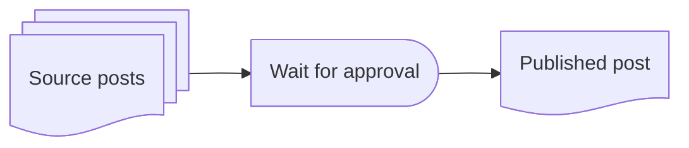
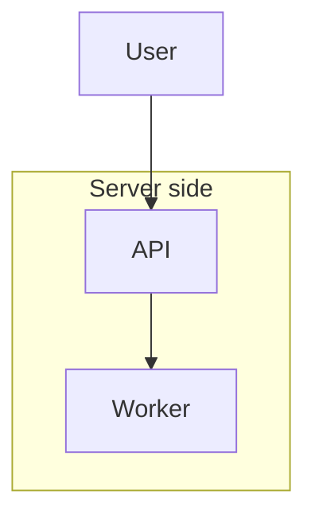
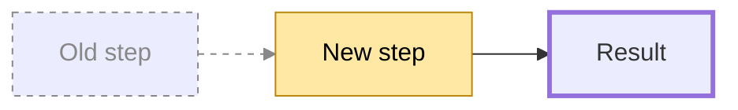
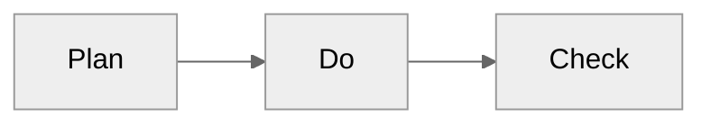

# Mermaid cheatsheet

Purpose: the syntax needed to draw every family in `layout-catalog.md`, plus
the differences between renderers and how to export an image. Verified with
Mermaid 11. Where a feature needs a newer version, the section says so.

Contents

1. Flowchart header and direction
2. Node shapes
3. Arrows and lines
4. Subgraphs and per-subgraph direction
5. Styling: classDef, style, linkStyle
6. Config block (curve, theme, hand-drawn look)
7. Other diagram types (one-line reminders)
8. Text rules: quoting, line breaks, special characters
9. Renderer differences
10. Export to PNG, SVG, PDF

---

## 1. Flowchart header and direction

```text
flowchart TD    top to bottom (TB is the same)
flowchart BT    bottom to top
flowchart LR    left to right
flowchart RL    right to left
```

`graph` is an older alias for `flowchart`. Use `flowchart`.

The direction applies to the whole diagram. Subgraphs may override it, with a
limitation described in section 4.

## 2. Node shapes

| Syntax               | Shape                  | Use for                        |
|----------------------|------------------------|--------------------------------|
| `A[text]`            | rectangle              | action, step                   |
| `A(text)`            | rounded rectangle      | soft group, optional step      |
| `A([text])`          | stadium                | start, end                     |
| `A[[text]]`          | subroutine             | subprocess with its own diagram|
| `A[(text)]`          | cylinder               | database, storage              |
| `A((text))`          | circle                 | event, connector               |
| `A(((text)))`        | double circle          | final state                    |
| `A>text]`            | asymmetric flag        | input signal, trigger          |
| `A{text}`            | diamond                | decision                       |
| `A{{text}}`          | hexagon                | preparation                    |
| `A[/text/]`          | parallelogram          | input, output, document        |
| `A[\text\]`          | reverse parallelogram  | output (when both are needed)  |
| `A[/text\]`          | trapezoid              | manual step                    |
| `A[\text/]`          | inverted trapezoid     | rarely needed                  |

Mermaid 11.3 and newer also accept `A@{ shape: name, label: "text" }` with
more shapes: `doc` (document with wavy bottom), `docs` (stack of documents),
`cyl` (cylinder), `h-cyl` (horizontal cylinder, direct access storage),
`lin-cyl` (disk), `delay`, `hourglass` (collate), `bolt` (communication link),
`brace` (comment), `fork`, `notch-rect` (card), `sm-circ` (start), `fr-circ`
(stop), `text` (no border), `flag`, `curv-trap` (display), `div-rect`
(divided process), `tri` (extract), `flip-tri` (manual file). Example:



Use the `@{ shape }` syntax only when the renderer is known to be Mermaid 11.3
or newer (GitHub, current Obsidian, mmdc). Fall back to the bracket shapes
otherwise.

## 3. Arrows and lines

| Syntax          | Meaning                                    |
|-----------------|--------------------------------------------|
| `A --> B`       | arrow: then, causes, sends                 |
| `A --- B`       | line, no arrowhead: membership, relation   |
| `A -.-> B`      | dashed arrow: optional, async, response    |
| `A ==> B`       | thick arrow: main path, emphasis           |
| `A -->|text| B` | labeled arrow                              |
| `A -- text --> B` | labeled arrow, alternative syntax        |
| `A <--> B`      | both directions                            |
| `A --o B`       | circle end: aggregation                    |
| `A --x B`       | cross end: blocked, rejected               |
| `A ~~~ B`       | invisible edge: forces layout order only   |
| `A ----> B`     | extra dashes: pushes B one rank further    |
| `A --> B --> C` | chain                                      |
| `A & B --> C`   | two sources into one target                |
| `A --> B & C`   | one source into two targets                |

Label every arrow whose meaning is not just "then".

## 4. Subgraphs and per-subgraph direction



`subgraph id[Title]` defines a group. `direction` inside the subgraph sets its
own layout.

Limitation: when any node inside a subgraph is connected to a node outside it,
Mermaid ignores that subgraph's `direction` and uses the parent direction. In
the sample above, `API` links to `U` outside, so `direction LR` is ignored and
the subgraph lays out TD. To keep a subgraph direction, connect the subgraph
itself (`U --> server`) instead of a node inside it, or accept the parent
direction. This is why swimlanes and rings cannot be built from subgraphs with mixed
directions. See `layout-catalog.md`, section 4 (rings via `block-beta`) and
section 14 (swimlanes via sequence diagram or color per role).

To stack two independent subgraphs in a fixed order, connect the subgraphs
with an invisible edge: `before ~~~ after`. Nodes inside keep their own
`direction`.

Hide a subgraph title with a single space: `subgraph row1[" "]`.

## 5. Styling



- `classDef name props` defines a reusable style. `class node1,node2 name`
  applies it. Shorthand: `B:::changed`.
- `style node props` styles one node.
- `linkStyle n props` styles the n-th edge, counted from 0 in source order.
- Use one highlight color for the one thing the diagram is about. Two colors
  at most (added, removed). Color must not be the only carrier of meaning:
  add a label or a dashed stroke as well.

## 6. Config block

Put the config on the first line, before the diagram type.



Useful keys:

- `"flowchart": {"curve": "linear"}` straight edges. Other values: `basis`
  (default curves), `step`, `stepAfter` for right-angle edges.
- `"flowchart": {"nodeSpacing": 40, "rankSpacing": 60}` tighter or looser.
- `"theme": "neutral"` gray, prints well. Others: `default`, `dark`,
  `forest`, `base`.
- `"look": "handDrawn"` sketch style (Mermaid 11).
- `"flowchart": {"htmlLabels": false}` plain SVG text, needed by some
  exporters.

## 7. Other diagram types

```text
mindmap                radial map. Indentation sets levels. root((text)) for
                       the center. Shapes: [square], (rounded), ((circle)),
                       ))cloud((, )bang(, {{hexagon}}. No direction setting.
sequenceDiagram        actors across the top. ->> request, -->> response,
                       -x lost message. loop / alt / opt / par blocks.
                       Note over A,B: text.
stateDiagram-v2        [*] start and end. A --> B : event. direction LR or TB.
                       state X { nested }. <<choice>> for branching.
timeline               title, then "period : event : event".
quadrantChart          x-axis, y-axis, quadrant-1..4, points [x, y] in 0..1.
sankey-beta            CSV lines "source,target,value".
gantt                  dateFormat, section, task : id, start, duration.
erDiagram              A ||--o{ B : label. Crow's foot cardinality.
classDiagram           boxes with fields and methods, inheritance arrows.
gitGraph               commit, branch, checkout, merge.
pie                    "label" : value.
xychart-beta           bar and line charts.
block-beta             fixed grid: columns N, blocks placed in reading order.
                       Use for a matrix or a dashboard-like layout.
```

## 8. Text rules

- Quote labels that contain `(`, `)`, `[`, `]`, `{`, `}`, `|`, `;`, `#` or
  start with a digit: `A["Step (1): read"]`.
- Line break inside a label: `<br>` when `htmlLabels` is on (default).
- `%%` starts a comment line.
- Node ids: letters, digits, underscore. `end` is a reserved word in
  flowcharts, use `End` or `finish`.
- Cyrillic and other Unicode in labels works in all diagram types. Keep node
  ids in Latin letters.
- Spaces in ids are not allowed. `Send invoice` as an id must be
  `send_invoice[Send invoice]`.

## 9. Renderer differences

| Renderer                         | Notes                                                                                         |
|----------------------------------|-----------------------------------------------------------------------------------------------|
| GitHub markdown                  | Current Mermaid. All types above work, including `@{ shape }` and `-beta` types. No `%%{init}%%` themes beyond defaults. |
| Notion                           | Renders ```` ```mermaid ```` code blocks. Version lags GitHub. Stay with `flowchart`, `mindmap`, `sequenceDiagram`, `stateDiagram-v2`, `timeline`, `pie`, `gantt`. Avoid `-beta` types and `@{ shape }`. |
| Obsidian                         | Recent Mermaid. Everything works.                                                             |
| Claude artifacts (HTML)          | `<pre class="mermaid">` blocks render natively. No library load needed.                       |
| Claude chat reply                | Mermaid fences render as diagrams in the app. In a terminal they show as code. Add a one-line text summary above the fence for terminal readers. |
| Telegram, plain email, SMS       | No rendering. Use `ascii-diagrams.md` templates or export a PNG.                              |
| README that must work everywhere | ASCII inside a ```` ```text ```` fence, or a committed SVG image plus the Mermaid source.        |
| FigJam                           | Not Mermaid. Use the Figma MCP `generate_diagram` tool with the same node and edge list.       |
| Miro                             | Not Mermaid. Use the Miro canvas tools with the same node and edge list.                      |

When the renderer is unknown, write the safe subset: `flowchart` with bracket
shapes, `mindmap`, `sequenceDiagram`, `stateDiagram-v2`.

## 10. Export to PNG, SVG, PDF

Install once (Node.js required):

```bash
npm install -g @mermaid-js/mermaid-cli
```

Render:

```bash
mmdc -i diagram.mmd -o diagram.svg
mmdc -i diagram.mmd -o diagram.png -b white -s 2     # white background, 2x scale
mmdc -i diagram.mmd -o diagram.pdf
```

Render every Mermaid fence inside a markdown file to images and get a copy of
the markdown with image links:

```bash
mmdc -i notes.md -o notes-rendered.md
```

If Chromium download is blocked, point mmdc at an installed browser with a
puppeteer config file:

```bash
echo '{"executablePath":"/path/to/chrome","args":["--no-sandbox"]}' > puppeteer.json
mmdc -p puppeteer.json -i diagram.mmd -o diagram.png
```

Check the rendered image before sending it. A diagram that parses can still
be laid out badly. Look for: lanes or rows that did not stay in place, labels
overlapping edges, a cycle that rendered as a straight line.
