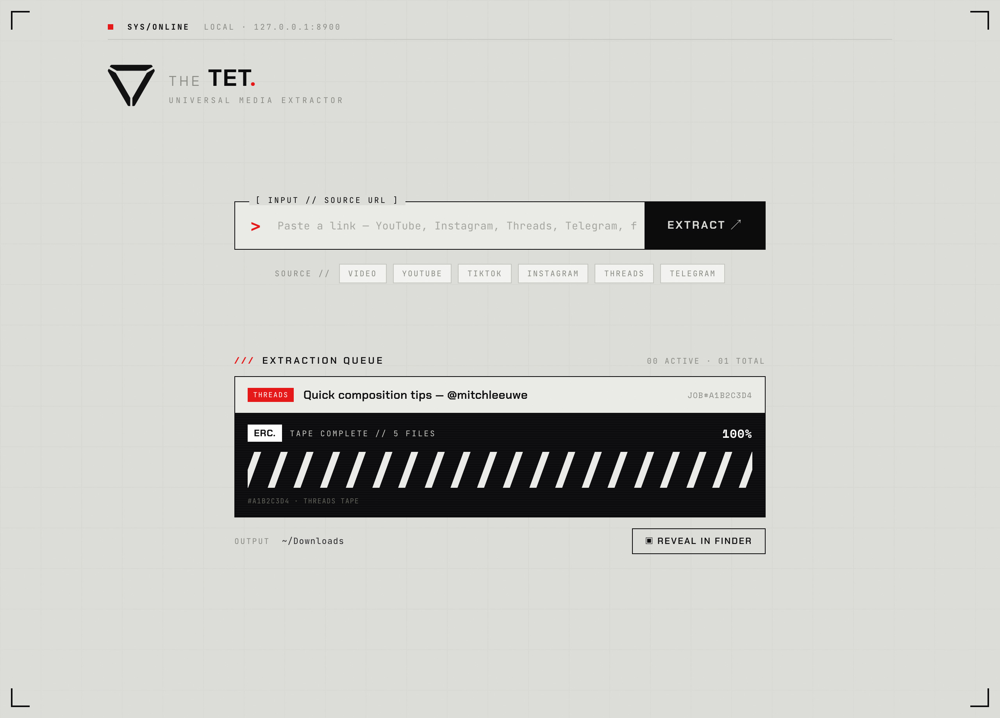

<div align="center">

# The TET

**A self-hosted, universal media extractor with a light tactical-HUD interface.**

Paste a link — YouTube, Instagram, Threads, a public Telegram post, or a direct
file — and The TET auto-detects the source and downloads the media straight into
your folder. No accounts, no ads, runs entirely on your machine.


<br>



</div>

---

## Features

- **One box, any link.** The source is detected from the URL and routed to the
  right download engine automatically.
- **Five engines under one roof** — video sites, Instagram, Threads, Telegram,
  and plain file links (see the table below).
- **Saves straight to a folder** — no "Save as" dialog dance. Default
  `~/Downloads`, configurable.
- **Live extraction queue** with an ERC "magnetic-tape" progress bar — diagonal
  stripes light up as the download is written.
- **Reveal in Finder** — jump straight to the downloaded file.
- **Clean, dependency-light UI** — vanilla HTML/CSS/JS, no build step.
- **Uses your browser session** — reads cookies from Chrome so logged-in /
  private content works.

## Supported sources

| Source | What it grabs | Engine |
|--------|---------------|--------|
| **Video** | YouTube, TikTok, X/Twitter, Vimeo, Reddit, Facebook, Twitch, Instagram **Reels**, and [1000+ other sites](https://github.com/yt-dlp/yt-dlp/blob/master/supportedsites.md) | [yt-dlp](https://github.com/yt-dlp/yt-dlp) |
| **Instagram** | Reels, posts, carousels, photos | [yt-dlp](https://github.com/yt-dlp/yt-dlp) (public reels/videos, no login) → [gallery-dl](https://github.com/mikf/gallery-dl) fallback |
| **Threads** | Post videos and images | headless Chromium via [Playwright](https://playwright.dev/python/) |
| **Telegram** | Media from **public** channel posts (video + photos) | built-in `t.me` embed scraper |
| **File** | Any direct file URL — `.mp4`, `.pdf`, `.zip`, `.jpg`, … | streamed HTTP download |

### What do "Video" and "File" mean?

- **Video** is the catch-all engine powered by yt-dlp. It's **not just YouTube** —
  it handles YouTube *and* 1000+ other video/audio sites (TikTok, X, Vimeo,
  Reddit, Twitch, SoundCloud, …). If you paste a link to a known video platform,
  it goes here.
- **File** is for **direct links to a file** — a URL that points straight at the
  bytes, e.g. `https://example.com/clip.mp4` or `…/report.pdf`. The TET just
  streams that file to disk as-is. Use it for anything that isn't a social
  platform page.

## How it works

```
                ┌──────────────┐
  paste URL ──▶ │  detect()    │ ──▶ threads   → Playwright (render + DOM)
                │  by hostname │ ──▶ instagram → gallery-dl
                │  + extension │ ──▶ telegram  → t.me embed scraper
                └──────────────┘ ──▶ file      → HTTP stream
                                 └─▶ video     → yt-dlp (1000+ sites)
                                          │
                                          ▼
                                   ~/Downloads
```

Each download runs in its own background thread; the UI polls job status and
animates the progress tape until the file lands in your output folder.

## Quick start

```bash
# 1. system prerequisites
brew install python ffmpeg

# 2. get the code
git clone https://github.com/alexandercroft/the-tet.git
cd the-tet

# 3. run it (first run sets everything up)
./run.sh
```

Then open **http://127.0.0.1:8900**, paste a link, and hit **EXTRACT**.

`run.sh` creates a virtualenv, installs the Python dependencies, and downloads a
Chromium build for Playwright (~150 MB, used only for Threads). Subsequent runs
just start the server.

### Manual setup (instead of run.sh)

```bash
python3 -m venv venv
source venv/bin/activate
pip install -r requirements.txt
python -m playwright install chromium
python app.py
```

## Usage

1. Paste a link into the input box. The matching **SOURCE** chip lights up so you
   can see how it was detected.
2. Press **EXTRACT** (or Enter).
3. A card appears in the **Extraction Queue** with a live progress tape.
4. When it reads **TAPE COMPLETE**, the file is already in your output folder.
5. Hit **REVEAL IN FINDER** to open it.

You can queue several links one after another — each gets its own card.

### Command line

Prefer the terminal? The same engines are available via a CLI:

```bash
source venv/bin/activate
python cli.py "https://www.youtube.com/watch?v=…"      # auto-detects source
python cli.py "https://t.me/channel/123"               # telegram
python cli.py "https://example.com/file.pdf"           # direct file
python cli.py "<url>" --audio                           # mp3 for video sources
python cli.py "<url>" -o ~/Movies                       # custom output folder
```

It prints the saved file paths to stdout.

## Configuration

All settings are environment variables:

| Variable | Default | Purpose |
|----------|---------|---------|
| `TET_OUTPUT` | `~/Downloads` | folder downloads are saved to |
| `TET_CHROME_PROFILE` | *(Chrome's default)* | which Chrome profile to read cookies from, e.g. `"Default"` or `"Profile 1"` |
| `PORT` | `8900` | local server port |

```bash
TET_OUTPUT="$HOME/Movies/TET" TET_CHROME_PROFILE="Default" ./run.sh
```

## Cookies & logins

The TET reads cookies from your local **Chrome** so it can fetch content that
requires being signed in.

- **Instagram public reels/videos work without any login** (handled by yt-dlp).
  Login is only needed for **private posts** and for the **gallery-dl fallback**
  (multi-image carousels / photo posts). To enable it, sign into Instagram in
  Chrome.
- If your session lives in a **non-default Chrome profile**, point
  `TET_CHROME_PROFILE` at it (e.g. `"Profile 1"`).
- **Threads** public posts work via headless rendering; being logged in helps
  with private or restricted posts.
- **Telegram** works only for **public** channels/posts (the `t.me` web preview).

## Troubleshooting

| Symptom | Fix |
|---------|-----|
| Instagram private/carousel fails | Public reels/videos need no login; for private posts or photo carousels, log into Instagram in Chrome (set `TET_CHROME_PROFILE` if needed) |
| Threads → "No media found" | The post may be private, or Chromium isn't installed (`python -m playwright install chromium`) |
| `ffmpeg not found` | `brew install ffmpeg` |
| Video download fails | Update yt-dlp: `pip install -U yt-dlp` |
| Wrong cookies used | Set `TET_CHROME_PROFILE` to the profile where you're logged in |

## Project structure

```
the-tet/
├── app.py              # Flask server, job queue, source routing
├── tet/
│   ├── detect.py       # URL → engine
│   ├── common.py       # output dir, cookies, filename/move helpers
│   ├── video.py        # yt-dlp
│   ├── instagram.py    # yt-dlp (public) + gallery-dl fallback
│   ├── threads.py      # Playwright
│   ├── telegram.py     # t.me embed scraper
│   ├── file.py         # direct HTTP download
│   └── logo.py         # inline logo (data URI)
├── templates/index.html
├── requirements.txt
└── run.sh
```

## Stack

- **Backend:** Python + Flask, one focused module per engine
- **Frontend:** vanilla HTML/CSS/JS, no framework, no build step
- **Engines:** yt-dlp · gallery-dl · Playwright · requests

## Inspired by ReClip

The TET is a spiritual successor to [ReClip](https://github.com/averygan/reclip) —
the same "paste a link, run it on localhost" idea, expanded to more sources and
saving straight to a folder. If you're looking for a **self-hosted media /
video / reels downloader** for **YouTube, TikTok, Instagram, Threads or
Telegram**, this is for you.

## Disclaimer

For personal use only. Respect copyright and the terms of service of the
platforms you download from. The author is not responsible for misuse.

## License

[MIT](LICENSE)
